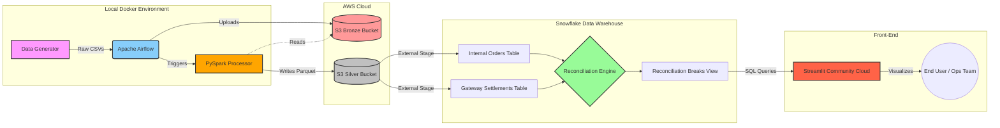

# Multi-Source Financial Settlement & Reconciliation Engine

An enterprise-grade data pipeline built to automate the reconciliation of internal financial orders against external payment gateway settlements. 

Deploy link : https://financial-reconciliation-engine-lqlzw9zxrnnygmqrqtxjsm.streamlit.app/

## System Architecture

The pipeline leverages a modern data stack to guarantee scalability and idempotency:
- **Data Generation**: A Python script (`data_generator.py`) generates mock `.csv` datasets simulating thousands of transactions, injecting real-world edge cases (missing IDs, delayed processing, decimal mismatches).
- **Orchestration**: Apache Airflow schedules and monitors the daily DAG (`reconciliation_dag.py`). It manages the dependencies between S3 uploads, Spark processing, and Snowflake querying.
- **Transformation (Silver Layer)**: PySpark (`spark_processor.py`) reads the raw CSVs, standardizes timezones to UTC, enforces strict `Decimal(10,2)` casting to prevent floating-point drift, and writes optimized `.parquet` files.
- **Data Warehousing (Gold Layer)**: Snowflake (`reconciliation_engine.sql`) ingests the Parquet files via an External Stage. It performs a highly-performant `FULL OUTER JOIN` to identify missing records and amount discrepancies, outputting to a `daily_reconciliation_breaks` table.
- **Visualization & Resilience**: A Streamlit dashboard (`dashboard.py`) visualizes the discrepancies live from Snowflake. To guarantee uptime for reviewers (e.g., if Snowflake credentials expire), it features a built-in DuckDB fallback that seamlessly queries a locally exported `fallback_data.parquet` sample.

## Getting Started 

To run this environment locally, follow these steps:

### 1. Configure Environment Variables
Copy the `.env.example` template to a new file named `.env` in the root of the project:
```bash
cp .env.example .env
```

Open the `.env` file and populate it with your active credentials:
```env
# AWS Credentials (For S3)
AWS_ACCESS_KEY_ID=your_aws_access_key
AWS_SECRET_ACCESS_KEY=your_aws_secret_key

# Snowflake Credentials
SNOWFLAKE_USER=your_snowflake_user
SNOWFLAKE_PASSWORD=your_snowflake_password
SNOWFLAKE_ACCOUNT=your_snowflake_account_identifier
```

### 2. Launch the Infrastructure
The entire environment (Airflow Scheduler, Webserver, PostgreSQL metadata DB, and Streamlit) is containerized. Launch it using:
```bash
docker compose up -d
```

### 3. Access the UIs
- **Apache Airflow**: [http://localhost:8080](http://localhost:8080) (Username: `admin`, Password: `admin`)
- **Streamlit Dashboard**: [http://localhost:8501](http://localhost:8501)

### 4. Running the Tests
A robust test suite validates the core processing logic (PySpark transformations and mocked SQL joins) without requiring a live cloud connection. 
```bash
python -m venv venv
# Activate the venv (e.g., venv\Scripts\activate on Windows)
pip install -r requirements.txt
pytest tests/test_pipeline.py
```

## 🗄️ Data Flow & Analysis
1. **Ingestion (Bronze Layer):** We feed the pipeline two distinct, high-volume financial data streams:
   - **Internal Ledgers:** The company's internal record of sales.
   - **External Gateway Reports:** End-of-day settlement reports from third-party payment processors (Stripe, PayPal, Adyen).
2. **Transformation (Silver Layer):** Airflow triggers a PySpark job that cleans the raw CSVs, enforces schemas, and writes highly compressed Parquet files to an AWS S3 data lake.
3. **Warehouse Loading & Reconciliation:** Snowflake ingests the Parquet files via an External Stage. A massive `FULL OUTER JOIN` is performed on the `order_id` between the internal ledger and gateway settlements. Conditional SQL logic (`CASE WHEN`) is applied to isolate and categorize transactions that don't perfectly match.
4. **Visualization:** A Streamlit dashboard queries the Snowflake warehouse in real-time to visualize the reconciliation breaks.
## 📊 Business Metrics Tracked
By running this analysis, the dashboard provides Finance and Operations teams with four critical business metrics:
* **Revenue Leakage (`Missing in Gateway`):** Identifies orders where a product/service was provided to a customer, but the payment gateway never actually sent the funds.
* **Orphaned Payments (`Missing in Internal`):** Identifies money deposited into the account that doesn't match any internal sale (which causes severe accounting and tax issues).
* **Financial Slippage (`Amount Mismatch`):** Flags transactions where the customer was charged $50, but the gateway only settled $48. This highlights currency conversion bugs, system rounding errors, or partial refunds.
* **Fee Transparency:** Tracks exactly how much the business is losing to payment processing fees.
## 📖 Data Dictionary
The pipeline transforms raw data into highly structured schemas:
**Internal Orders (Our System)**
* `order_id`: Unique identifier for the customer's purchase.
* `user_id`: The customer's account ID.
* `amount`: The amount the customer was charged on our platform.
* `timestamp_utc`: When the order was placed.
**Gateway Settlements (Third-Party Processor)**
* `settlement_id`: The payment gateway's internal transaction ID.
* `order_id`: The foreign key linking back to our internal order.
* `settled_amount`: The actual cash the gateway deposited into our bank account (excluding fees).
* `fee`: The processing fee taken by the gateway.
* `timestamp_utc`: When the cash was actually settled.


### High-Level Architecture Flow


### ETL Pipeline Sequence


### ER Diagram


